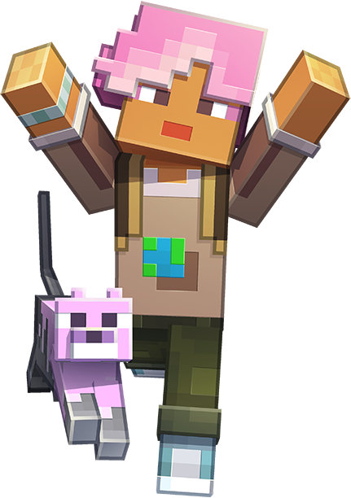

<p align="center">
  
</p>

# NiceMerl

*A fan homage to [Merl](https://minecraft.wiki/w/Earth:Merl), Minecraft Earth's mascot, now helping out on Explorer's Eden.*

NiceMerl is a Discord bot that answers questions in one channel by searching [wiki.explorerseden.eu](https://wiki.explorerseden.eu). It replies with the best-matching wiki pages and deep links to the matching sections. The top result shows the relevant sentences or list in full (often the complete answer), and the others show a short excerpt.

It runs no AI and calls no paid API, so it has no running costs. The bot downloads the public wiki pages on startup and every 6 hours, keeps a small search index in memory (BM25), and searches it locally. Wiki spoilers (collapsed `<details>` blocks) are shown as Discord `||spoilers||`.

## Setup

👉 **See [SETUP.md](SETUP.md) for the full step-by-step guide** (Discord app, avatar, permissions, server deployment, troubleshooting).

Quick version, once the Discord app exists:

```sh
cp .env.example .env   # fill in DISCORD_TOKEN and CHANNEL_ID
docker compose up -d --build
docker compose logs -f
```

Without Docker:

```sh
python3 -m venv .venv && .venv/bin/pip install -r requirements.txt
.venv/bin/python bot.py
```

## Usage

- Any message in the configured channel is treated as a question (one per user every 5 seconds).
- Saying hi (or @-mentioning her) gets a wave and a short intro.
- When nothing matches she answers *"I don't know."*, a nod to the [real Merl support agent](https://minecraft.wiki/w/Minecraft_Support_Virtual_Agent).
- `!reindex` (requires *Manage Server*) refreshes the index right away after wiki edits.
- To test the search without Discord: `python search.py "how do I get a boss key"`

## Configuration (`.env`)

| Variable | Default | |
|---|---|---|
| `DISCORD_TOKEN` | – | Bot token |
| `CHANNEL_ID` | – | Channel the bot answers in |
| `WIKI_URL` | `https://wiki.explorerseden.eu` | Wiki.js base URL |
| `REINDEX_HOURS` | `6` | How often to re-download the wiki |
| `RESULTS` | `3` | Results per answer |
| `COOLDOWN_SECONDS` | `5` | Per-user cooldown |

Search tuning (stopwords, title/path weights, minimum score) lives at the top of `search.py`.

## Assets

`assets/avatar.png` is the bot avatar (upload it in the Developer Portal). The `thumb_*.png` files are attached to the greeting and "I don't know" replies. The other images are only used in the docs.

<sub>Merl and Peanut Butter are characters from *Minecraft* © Mojang Studios. Images via the Minecraft Wiki ([Merl](https://minecraft.wiki/w/Earth:Merl), [Support Virtual Agent](https://minecraft.wiki/w/Minecraft_Support_Virtual_Agent)). NiceMerl is an unofficial fan homage and isn't affiliated with or endorsed by Mojang or Microsoft.</sub>
